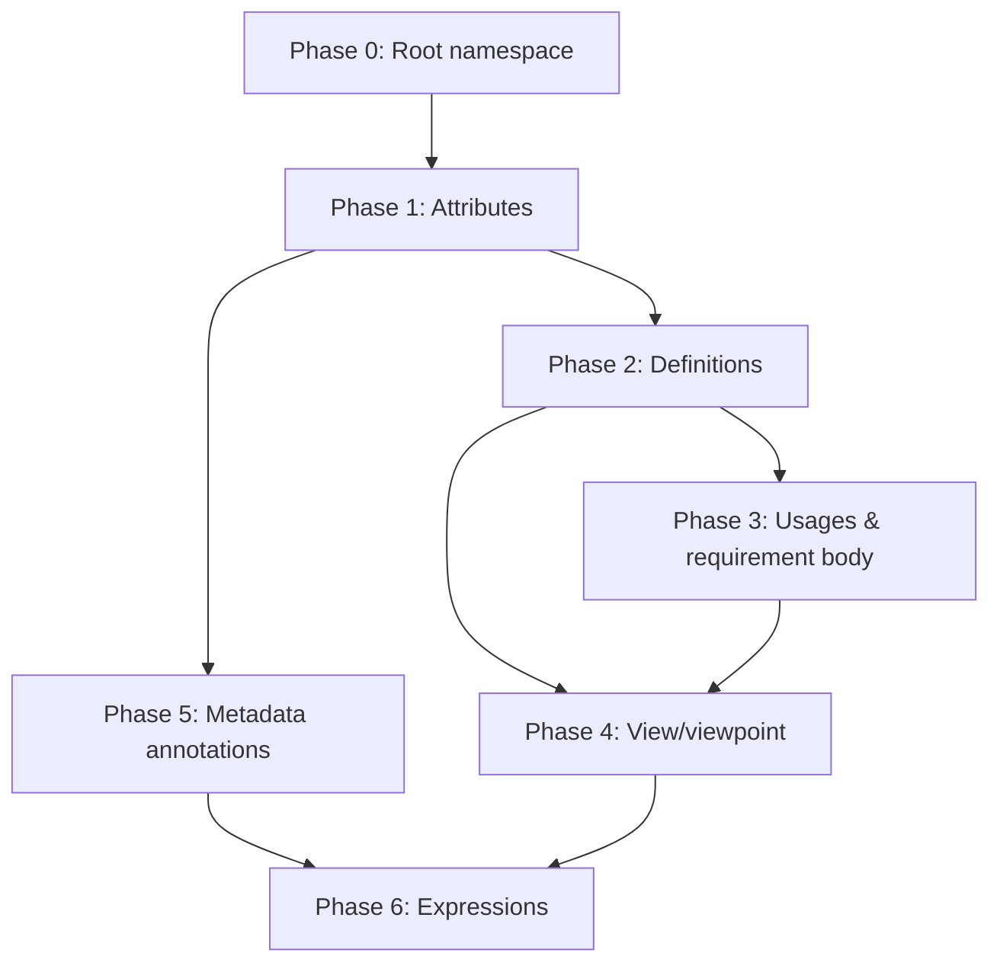

# Full BNF Coverage Plan

A phased plan to implement full SysML v2 BNF coverage in sysml-parser, enabling all 56 validation files in `sysml-v2-release/sysml/src/validation` to parse successfully.

**Reference:** [SysML-textual-bnf.kebnf](../sysml-parser/sysml-v2-release/bnf/SysML-textual-bnf.kebnf)  
**Current status:** 10 of 56 validation files pass (as of plan creation).

---

## Phase Overview

| Phase | Focus | Est. validation files unlocked |
|-------|-------|-------------------------------|
| 0 | Root namespace & error reporting | 1 |
| 1 | Attributes: redefines, specializes, value expressions | 8+ |
| 2 | Missing definitions (connection, metadata, enum, library, occurrence) | 6+ |
| 3 | Missing usages & requirement body (frame, concern, dependency) | 5+ |
| 4 | View/viewpoint (expose, full render, satisfy in view) | 2 |
| 5 | Metadata annotations (@Usage with body) | 3+ |
| 6 | Expressions (units, filter chains, feature refs) | 10+ |

---

## Phase 0: Root Namespace & Error Reporting ✅

**BNF:** `RootNamespace = PackageBodyElement*` (Clause 8.2.2.5.2)

**Completed:**
1. **Top-level imports** — Allow `Import` at root before any package. Added `RootElement::Import`. Parser now accepts `private import Views::*;` followed by `package P { }`. (11b still fails on `metadata def` inside—Phase 2.)
2. **Error context** — Updated expected context to `'package', 'namespace', or 'import' at top level; or valid element in package body`.

**Files:** `sysml-parser/src/ast.rs`, `sysml-parser/src/parser/mod.rs`, `sysml-parser/src/parser/package.rs`, server (symbols, semantic_tokens, model, semantic_model)

---

## Phase 1: Attributes — Redefines, Specializes, Value Expressions

**BNF:** `Redefines`, `OwnedRedefinition`, `FeatureTyping` (DEFINED_BY `:>`), `FeatureValue`, `ValuePart` (Clauses 8.2.2.6.5, 8.2.2.6.2, 8.2.2.7)

**Current gap:** Parser does not handle:
- `redefines` (`:>>` or keyword) in attributes and parts
- `:>` (specializes) in attribute typing
- `default =`, `:=` in value part
- Unit literals `2500[SI::kg]`, `[kg]`

**Tasks:**
1. **Redefines** — Add `OwnedRedefinition` to `PartUsage`, `AttributeUsage`; parse `redefines QualifiedName` (and `:>>`).
2. **Specializes in attributes** — Parse `:> Type` in attribute def/usage (already in BNF as `DEFINED_BY` / `SPECIALIZES`).
3. **Value part** — Parse `= expr`, `default = expr`, `:= expr` in usages.
4. **Unit literals** — Extend expression parser for `value [unit]` and `[unit]` (Bracket, LiteralWithUnit).

**Validation files unlocked:** 1c, 1d, 15_02, 15_03, 15_04, 15_08, 15_13, 15_19, 15_19a, 10c, 10a, 10b, 15_01 (partial).

**Files:** `sysml-parser/src/ast.rs`, `sysml-parser/src/parser/attribute.rs`, `sysml-parser/src/parser/part.rs`, `sysml-parser/src/parser/expr.rs`

---

## Phase 2: Missing Definitions

**BNF:** `ConnectionDefinition`, `MetadataDefinition`, `EnumerationDefinition`, `LibraryPackage`, `OccurrenceDefinition` (Clauses 8.2.2.13, 8.2.2.27, 8.2.2.8, 8.2.2.5, 8.2.2.9)

**Current gap:** Parser lacks:
- `connection def`
- `metadata def`
- `enum def`
- `library package`
- `occurrence def`

**Tasks:**
1. **ConnectionDefinition** — `connection def` Identification DefinitionBody. Add to `PackageBodyElement` and `DefinitionElement`.
2. **MetadataDefinition** — `metadata def` Definition (optional `abstract` prefix). Add to `PackageBodyElement`.
3. **EnumerationDefinition** — `enum def` Identification EnumerationBody (`;` or `{` EnumeratedValue* `}`). Add `EnumDef`, `EnumerationBody`, `EnumeratedValue`.
4. **LibraryPackage** — `library` (optional `standard`) PackageDeclaration PackageBody. Add to `RootElement` or `PackageBodyElement` (BNF has it as DefinitionElement via Package).
5. **OccurrenceDefinition** — `occurrence def` Definition. Add to `PackageBodyElement`.

**Validation files unlocked:** 3c-1, 3c-2, 13b-1, 13b-2, 14a, 14c, 15_10, 17a, 17b, 3e.

**Files:** `sysml-parser/src/ast.rs`, `sysml-parser/src/parser/` (new: `connection.rs`, `metadata.rs`, `enumeration.rs`; extend `package.rs`)

---

## Phase 3: Missing Usages & Requirement Body

**BNF:** `Dependency`, `FramedConcernMember`, `ConcernUsage`, `UseCaseUsage`, `RequirementUsage` (Clauses 8.2.2.3, 8.2.2.21)

**Current gap:** Parser lacks:
- `dependency` at package level
- `frame` in RequirementBody (viewpoint/requirement)
- `concern` usage
- `use case` usage (we have `use case def`; usage may differ)
- Requirement usage without `requirement` keyword in some forms

**Tasks:**
1. **Dependency** — `dependency` DependencyDeclaration RelationshipBody. Add `Dependency` to `PackageBodyElement`. Parse `from` client `to` supplier.
2. **FramedConcernMember** — `frame` FramedConcernUsage in RequirementBody. Add to `RequirementDefBodyElement`; parse `frame` name (`;` or body).
3. **ConcernUsage** — `concern` ConstraintUsageDeclaration RequirementBody. Add `ConcernUsage` to `PackageBodyElement`.
4. **UseCaseUsage** — Verify `use case` usage parsing; add if missing.
5. **RequirementUsage** — Ensure requirement usage without leading `requirement` (e.g. `requirement torqueGeneration {`) is handled.

**Validation files unlocked:** 12a, 11a (partial), 13a, 18, 12b, 12b-Allocation, 08.

**Files:** `sysml-parser/src/parser/requirement.rs`, `sysml-parser/src/parser/package.rs`, new `dependency.rs`

---

## Phase 4: View & Viewpoint — Expose, Render, Satisfy

**BNF:** `Expose`, `ViewRenderingUsage`, `ViewBodyItem`, `SatisfyRequirementUsage` (Clauses 8.2.2.26, 8.2.2.21.2)

**Current gap:** View body supports `render` but not:
- `expose` (MembershipExpose | NamespaceExpose)
- Full `render` forms (e.g. `render asElementTable { view :>> columnView[1] { render asTextualNotation; } }`)
- `satisfy` in view body

**Tasks:**
1. **Expose** — Parse `expose` (MembershipImport | NamespaceImport) in ViewBody. Add `Expose` to `ViewBodyElement`.
2. **ViewRenderingUsage** — Extend for `OwnedReferenceSubsetting`, `FeatureSpecializationPart`, nested `view` with `:>>` (references).
3. **Satisfy in view** — Parse `satisfy` QualifiedName in ViewBody. Add `Satisfy` to `ViewBodyElement`.
4. **Filter expressions** — Parse `**[@SysML::PartUsage]`-style filter in expose.

**Validation files unlocked:** 11a, 11b (with Phase 0).

**Files:** `sysml-parser/src/parser/view.rs`, `sysml-parser/src/ast.rs`

---

## Phase 5: Metadata Annotations ✅

**BNF:** `PrefixMetadataAnnotation`, `MetadataUsage`, `MetadataBody` (Clause 8.2.2.27)

**Completed:**
1. **MetadataUsage** — Parse `@` Identification (`:` Type)? MetadataBody. Added as `MetadataAnnotation` in `PartUsageBodyElement`.
2. **MetadataBody** — `;` or `{` ConnectBody `}` (reuses connect_body for `;` or `{ ... }`).
3. **Wire annotations** — Metadata annotations on part usages via `part_usage_body_element`.
4. **Filter expressions** — `@MetadataName` in expressions (e.g. `filter @Safety;`), plus `or`/`and` keywords for logical operators.

**Validation files:** 13b-Safety and Security Features Element Group.sysml passes. 13b-1, 13b-2 still need Phase 2 (metadata def) and Phase 6 (filter chains `**`, `::`, import filter `**[@Safety]`).

**Files:** `sysml-parser/src/ast.rs`, `sysml-parser/src/parser/metadata_annotation.rs`, `sysml-parser/src/parser/part.rs`, `sysml-parser/src/parser/expr.rs`

---

## Phase 6: Expressions & Advanced Features (partial) ✅

**BNF:** `LiteralExpression`, `FeatureReferenceExpression`, `OwnedFeatureChain`, filter expressions (Clauses 8.2.2.6.6, expression grammar)

**Completed:**
1. **:: qualified member access** — Added `::` postfix in expressions (e.g. `Safety::isMandatory`).
2. **Import filter after ::** — Parse optional `[ expr ]` after `vehicle::**` (e.g. `import vehicle::**[@Safety];`).
3. **Abstract/variation on part def** — Parse `abstract part def`, `variation part def` (DefinitionPrefix).

**Validation files unlocked:** 13b-1, 13b-2 (now pass).

**Remaining (Phase 6 continued):**
- Unit literals `2500[SI::kg]`, `[kg]` (also Phase 1)
- Feature chains `SystemModel::vehicle::**` in expose
- `abstract part` usage (not just `abstract part def`) — 7a fails on `abstract part anyVehicleConfig`
- Short-name in identification, other definition types (occurrence, port, etc.)

**Files:** `sysml-parser/src/ast.rs`, `sysml-parser/src/parser/expr.rs`, `sysml-parser/src/parser/import.rs`, `sysml-parser/src/parser/part.rs`

---

## Dependency Order



---

## Validation Progress Tracking

After each phase, run:

```bash
cargo test -p sysml-parser -- test_full_validation_suite --ignored
```

Record pass count and newly passing files. Update this plan with actual numbers as phases complete.

---

## Out of Scope (Defer)

- **Semantic validation** (spec-2): multiplicity, typing, redefines semantics
- **KerML-specific** constructs not in SysML validation set
- **Full CalculationBody / ActionBody** complexity (can be incremental)

---

## Reference: Validation File → Phase Mapping

| File | Blocking phase(s) |
|------|-------------------|
| 11b-Safety and Security Feature Views | 0 (top-level import) |
| 1c-Parts Tree Redefinition | 1 (redefines) |
| 1d-Parts Tree with Reference | 1 (redefines, refs) |
| 2c-Parts Interconnection-Multiple Decompositions | 1, 6 |
| 3a-2, 3a-3 Function-based Behavior | 6 (action with quoted name) |
| 3c-1, 3c-2 Function-based Behavior | 2 (connection def) |
| 3d, 3e Function-based Behavior | 2 (item), 6 |
| 05-State-based Behavior | 6 (state in nested context) |
| 06-Individual and Snapshots | 6 |
| 07-Variant Configuration | 6 (abstract, variation) |
| 08-Requirements | 3 (requirement usage) |
| 09-Verification | 6 |
| 10a, 10b, 10c, 10d Analysis | 1, 2, 6 |
| 11a-View-Viewpoint | 3 (frame, concern), 4 (expose, satisfy, render), 5 |
| 12a-Dependency | 3 (dependency) |
| 12b-Allocation | 3 |
| 13a-Model Containment | 3 |
| 13b-1, 13b-2 | 2 (metadata def), 5 |
| 14a-Language Extensions | 2 (enum def) |
| 14c-Language Extensions | 2 (library package) |
| 15_01 through 15_19 | 1, 5, 6 |
| 17a, 17b Sequence Modeling | 2 (occurrence def) |
| 18-Use Case | 3 (use case usage) |
